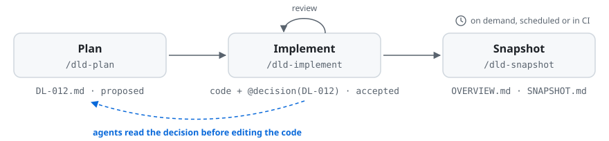

# DLD Kit

**Stop AI agents from breaking code they don't understand.**

Code is full of choices that look odd without their reason: a retry tuned to one API's rate limits, a check for a bug that only shows up in production. The reasons live in tickets, chat threads and people's heads, where an agent can't find them. Decision-Linked Development (DLD) writes each choice down as a short decision record and links it to the code with an `@decision(DL-012)` comment. When an agent sees that comment, it reads the decision before it changes the code.

<picture>
  <source media="(prefers-color-scheme: dark)" srcset="docs/assets/dld-workflow-dark.svg">
  
</picture>

> [!NOTE]
> **1.0 is in release candidates.** The install steps below get the latest one. It replaces the 0.x skills and their scripts, and commands, file formats and skills may still change before 1.0.0. Coming from 0.x? See [Upgrading from 0.x](#upgrading-from-0x), or stay on [v0.9.0](https://github.com/jimutt/dld-kit/releases/tag/v0.9.0).

DLD Kit is a set of [Agent Skills](https://agentskills.io) for Claude Code, Codex, Cursor, OpenCode, Pi, Antigravity and Copilot CLI, plus a small CLI that installs them.

**Contents:** [Quickstart](#quickstart) · [How it works](#how-it-works) · [Workflows](#workflows) · [Skills](#skills) · [Install](#install) · [Configuration](#configuration) · [DLD and spec-driven development](#dld-and-spec-driven-development) · [CLI](#cli) · [Learn more](#learn-more)

## Quickstart

You need Node.js 20+ and git. In the root of your repository, run:

```bash
npx dld-kit init
```

`init` asks which agents your team uses, suggesting the ones it finds. It then writes `dld.config.yaml`, a `decisions/` folder, the DLD skills and a short always-on rule that tells the agent to look decisions up. Commit the files, and your teammates need nothing installed.

Then, in your agent:

```
/dld-plan add retries to the payment client   # talk it through, get proposed decisions
/dld-implement                                 # write and review the code, add @decision comments
/dld-snapshot                                  # regenerate OVERVIEW.md and SNAPSHOT.md
```

These are Claude Code's slash commands. In Pi, use `/skill:dld-plan`. In other agents, ask for the skill by name: "use the dld-plan skill to plan retries for the payment client".

For a small, one-off choice, `/dld-decide` records a single decision. For an existing codebase, start with `/dld-retrofit`. To install once for all your repositories instead, see [Install](#install).

## How it works

A **decision** is a markdown file in `decisions/records/`:

```markdown
---
id: DL-012
title: "Use exponential backoff for payment gateway retries"
status: accepted
tags: [payments]
references:
  - path: src/payments/gateway.ts
---

## Context
The gateway returns 503s under load. Fixed-interval retries made it worse.

## Decision
Exponential backoff with jitter, capped at 30 seconds, at most 5 attempts.
```

A full record also has Rationale and Consequences sections; see the [decision record format](docs/framework/decision-record-format.md).

An **annotation** links code to the decision:

```typescript
// @decision(DL-012)
function retryWithBackoff(fn: () => Promise<Response>): Promise<Response> {
```

The **always-on rule**, installed for each agent, tells it to read the decision behind an annotation before changing that code. If a change would contradict the decision, the agent checks with you, and a new decision records the change.

A few things follow from this:

- **Decisions are never rewritten.** Once `accepted`, a decision's text stays as it is. To change course, you record a new decision that supersedes or amends it, so the history stays complete. Statuses run `proposed` → `accepted` → `superseded` or `deprecated`.
- **The docs are generated.** `/dld-snapshot` builds `OVERVIEW.md` and `SNAPSHOT.md` from the decisions. You never edit a spec by hand.
- **Drift gets caught.** `/dld-audit` finds annotations without a decision, references to code that moved, and annotated code that changed.
- **Conventions live in one file.** An optional `decisions/PRACTICES.md` holds your testing, style and architecture conventions, and `/dld-implement` follows it.

DLD gives agents context, not guarantees. Keep your tests.

## Workflows

- **New feature:** `/dld-plan`, then `/dld-implement`, then `/dld-snapshot`. `/dld-adjust` refines a decision before it's implemented.
- **Small change:** `/dld-decide` records one decision, then `/dld-implement`.
- **Existing codebase:** `/dld-retrofit` writes decisions and annotations for code you already have. Follow it with `/dld-snapshot`.
- **Hands-off:** after a one-time `/dld-retrofit`, run `/dld-audit-auto` and `/dld-snapshot` on a schedule or in CI. The audit finds undocumented changes, records decisions for them and opens a PR, so nobody has to change how they work.
- **Teams:** two branches can pick the same `DL-NNN`. Run `/dld-reindex` before you rebase. It renames your drafts to free IDs and updates everything that refers to them.

More detail, with diagrams: [workflows](docs/workflows.md).

## Skills

| Skill | What it does |
|---|---|
| `/dld-init` | Set up DLD in a repository: config, decisions folder and always-on rule |
| `/dld-plan` | Break a feature into proposed decisions |
| `/dld-decide` | Record one decision |
| `/dld-implement` | Implement proposed decisions, with a review step |
| `/dld-adjust` | Change a decision, following the rules for its status |
| `/dld-lookup` | Find decisions by ID, tag, file or keyword |
| `/dld-status` | Summarize the decision log |
| `/dld-audit` | Find drift between decisions and code |
| `/dld-audit-auto` | Audit, fix and open a PR, for scheduled runs |
| `/dld-snapshot` | Generate `OVERVIEW.md` and `SNAPSHOT.md` from the decisions |
| `/dld-retrofit` | Write decisions for existing code |
| `/dld-reindex` | Fix decision ID clashes before a rebase |

## Install

Every option installs the same skills. You need Node.js 20+ and git; `gh` is optional (`/dld-reindex` uses it to check open PRs).

### Which one to use

**Not sure? Run `npx dld-kit init` in the repository and commit the result.** It works for every supported agent, and teammates need nothing installed.

- **Use `npx dld-kit init` if** DLD is for a shared repository, the team uses more than one agent, or you want the setup reviewed and versioned with the code. This fits most projects, new or existing.
- **Use the Claude Code plugin if** you use Claude Code and want DLD in your own setup across many repositories, without committing skills to each one. Run `/dld-init` once per repository for the config and the rule.
- **Use the Pi package, or the Codex or Copilot CLI plugin, if** the same applies to you in those agents.
- **Use `npx skills` or `gh skill` if** you already manage your agents' skills with that tool. Then update with it, not with `dld update`.

For each agent, pick one per repository: skills committed with `init`, or a user-level plugin or package. Having both makes the agent see every skill twice.

| Option | Agents | Install | Update |
|---|---|---|---|
| [`npx dld-kit init`](docs/install.md#npx-dld-kit-init) | Claude Code, Antigravity, Codex, Cursor, OpenCode, Pi | `npx dld-kit init` | `npx dld-kit@latest update` |
| [Claude Code plugin](docs/install.md#claude-code-plugin) | Claude Code | `/plugin marketplace add jimutt/dld-kit`, then `/plugin install dld@dld-kit` | `claude plugin marketplace update dld-kit`, then `claude plugin update dld@dld-kit` |
| [Codex and Copilot CLI plugins](docs/install.md#codex-and-copilot-cli-plugins) | Codex, Copilot CLI | `codex plugin marketplace add jimutt/dld-kit`; `copilot plugin marketplace add jimutt/dld-kit`, then `copilot plugin install dld@dld-kit` | Codex's plugin manager; `copilot plugin update` |
| [Pi package](docs/install.md#pi-package) | Pi | `pi install npm:dld-kit` | `pi update npm:dld-kit` |
| [`npx skills` / `gh skill`](docs/install.md#npx-skills-or-gh-skill) | Any agent those tools support | `npx skills add jimutt/dld-kit`; `gh skill install jimutt/dld-kit --all` | `npx skills update`; `gh skill update` |
| [Manual copy](docs/install.md#manual-copy) | Any Agent Skills agent | Copy the `dld-*` folders from [`skills/`](skills/) | Copy again |

Apart from `init`, run the dld-init skill once per repository for the config and the always-on rule.

<a name="combining-channels"></a><a name="agents"></a><a name="manual-rule-setup"></a>
Where each agent keeps its skills and rule, how the options combine, and how to add the rule by hand: [install details](docs/install.md).

### Upgrading from 0.x

Your config, decisions, index and state carry over as they are. In the repository, run `npx dld-kit@latest update --agent <names>` (for example `--agent claude,codex`) and commit the result. It replaces the copied skills and their scripts, and installs the always-on rule. Then delete the old `## DLD (Decision-Linked Development)` section from `CLAUDE.md`.

Tessl installs and skills copied to other folders need one more step first: see [upgrading from 0.x](docs/upgrading-from-0x.md).

## Configuration

`dld.config.yaml` holds the settings. The ones you're most likely to change:

- **`mode: namespaced`** with a `namespaces` list gives each area of a monorepo its own decision folder (`npx dld-kit init --namespaces billing,auth`). IDs stay unique across namespaces.
- **`implement_review: false`** skips the review subagent in `/dld-implement`.
- **`snapshot_artifacts`** adds documents for `/dld-snapshot` to generate, each from a prompt you write.
- **`annotation_exclude`** lists paths whose `@decision` comments are only examples, such as docs.

All the options: [project configuration](docs/framework/project-configuration.md).

## DLD and spec-driven development

Spec-driven tools such as [Spec Kit](https://github.blog/ai-and-ml/generative-ai/spec-driven-development-with-ai-get-started-with-a-new-open-source-toolkit/), [OpenSpec](https://openspec.dev/) and [Kiro](https://kiro.dev/) work well, especially for new projects. If they fit your team, use them. DLD is for long-lived code, where specs tend to go stale:

- **Decisions instead of a spec.** You record each decision once and never rewrite it, so the history of why the code looks the way it does stays complete.
- **The spec is generated.** The overview docs are built from the decisions, the way event sourcing builds a read model from events.
- **The context sits in the code.** An annotation next to the code sends the agent straight to the reasoning.

More in the [FAQ](docs/concept/dld-faq.md) and the [concept paper](docs/concept/dld-concept.md).

## CLI

Run `npx dld-kit <command>`, or `npm install --global dld-kit` for a `dld` command. The skills carry their own copy of the CLI, so they never need a global install.

| Command | What it does |
|---|---|
| `dld init` | Set up DLD, the skills and the always-on rule |
| `dld update` | Update the installed skills and rule; `--agent` adds agents |
| `dld install-rule --agent <names>` | Install or refresh only the always-on rule |
| `dld session-context --agent <name>` | Print the rule for a session hook, unless the agent loads it already |

`init` and `update` won't overwrite files from a newer dld-kit unless you pass `--force`.

Semantic versioning covers these four commands (their flags, exit codes and documented output), `--help` and `--version`. The other commands in `dld --help` are internal: the skills run them, and they can change in a minor release.

## Learn more

- [Concept paper](docs/concept/dld-concept.md): the full reasoning behind DLD
- [TL;DR](docs/concept/dld-tldr.md) and [FAQ](docs/concept/dld-faq.md)
- [Decision record format](docs/framework/decision-record-format.md) and [project configuration](docs/framework/project-configuration.md)
- [Install details](docs/install.md), [workflows](docs/workflows.md) and [upgrading from 0.x](docs/upgrading-from-0x.md)
- [Contributing](CONTRIBUTING.md) and [releasing](docs/releasing.md)

Ideas and bug reports are welcome: [open an issue](https://github.com/jimutt/dld-kit/issues).

## Acknowledgements

DLD builds on [Architecture Decision Records](https://www.cognitect.com/blog/2011/11/15/documenting-architecture-decisions), [Embedded ADRs](https://github.com/adr/e-adr), [Vibe ADR](https://medium.com/devops-ai/vibe-adr-building-with-intention-in-the-age-of-ai-d01e93f36696), [OpenSpec](https://openspec.dev/), [Spec Kit](https://github.blog/ai-and-ml/generative-ai/spec-driven-development-with-ai-get-started-with-a-new-open-source-toolkit/), [IIC Kit](https://github.com/docsforadobe/intent-integrity-for-claude-code), [Kiro](https://kiro.dev/) and event sourcing. See [what each one contributed](docs/concept/acknowledgements.md).

## License

[MIT](LICENSE)
