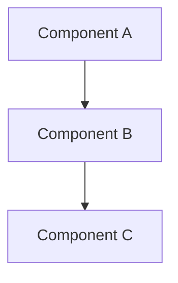
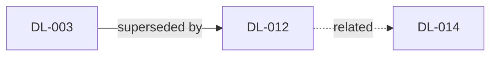

# /dld-snapshot — Generate Spec Projection

You are generating documents that project the current state of the decision log into readable formats. The two built-in documents are always generated:

1. **`decisions/SNAPSHOT.md`** — Detailed per-decision reference. Every active decision with its rationale and code references.
2. **`decisions/OVERVIEW.md`** — High-level narrative synthesis with Mermaid diagrams. The document you'd hand to someone who needs to understand the system.

If the project's `dld.config.yaml` defines `snapshot_artifacts`, additional custom documents are generated as well (see Step 4).

## Script Paths

Shared scripts (used indirectly via skill scripts):
```
../dld-common/scripts/common.sh
```

Skill-specific scripts:
```
scripts/collect-active-decisions.sh
scripts/update-snapshot-state.sh
```

## Prerequisites

Check that `dld.config.yaml` exists at the repo root. If not, tell the user to run `/dld-init` first and stop.

There must be at least one `accepted` decision. If all decisions are `proposed`, tell the user there's nothing to snapshot yet and suggest `/dld-implement`.

## Step 1: Collect active decisions

```bash
bash scripts/collect-active-decisions.sh
```

This outputs the full content of all `accepted` decisions, separated by `===DLD_DECISION_BOUNDARY===` markers. Parse the output to extract each decision's frontmatter and body. Use the project mode from `dld.config.yaml` (already checked in prerequisites) to determine the organization strategy.

## Step 2: Generate SNAPSHOT.md

Write `decisions/SNAPSHOT.md` — the detailed per-decision reference.

### Template

```markdown
# System Snapshot

> Auto-generated from the decision log on YYYY-MM-DD. Do not edit manually.
> Use `/dld-snapshot` to regenerate. Source of truth: individual decision records.
>
> **Active decisions:** N (DL-001 through DL-XXX, excluding superseded/deprecated)

---

## <Namespace or Tag Group>

### DL-NNN: <Title>
*Supersedes: DL-XXX* ← only if applicable

<The Decision section from the record — what was decided. Copy verbatim or lightly condense.>

**Rationale:** <1-3 sentence summary of the Rationale section. Condense, don't copy verbatim.>

**Code:** `<path>` → `<symbol>`, `<path>`

---

### DL-NNN: <Title>
...
```

### Organization rules

**Namespaced projects:** Primary grouping by namespace. Within each namespace, decisions listed by ID ascending (oldest first — they build on each other).

**Flat projects:** Group by tag. Decisions with multiple tags appear under their first/primary tag. Decisions with no tags go under a "General" section. Within each group, decisions listed by ID ascending.

### Content rules

- Only include `accepted` decisions
- Skip `superseded`, `deprecated`, and `proposed` decisions entirely
- When a decision supersedes another (check the `supersedes` field in the YAML frontmatter), include a `*Supersedes: DL-XXX*` note
- The **Decision** section content should be copied directly or lightly condensed — this is the authoritative statement
- The **Rationale** should be condensed to 1-3 sentences — enough to understand *why*, not every detail
- **Code** references should list paths and symbols from the frontmatter `references` field
- If a decision has no Rationale section, omit the Rationale line
- If a decision has no references, omit the Code line

## Step 3: Generate OVERVIEW.md

Write `decisions/OVERVIEW.md` — the high-level narrative synthesis.

This is fundamentally different from SNAPSHOT.md. You are **synthesizing** across decisions to create a readable narrative that explains the system's current design. Think of it as the document you'd give a new team member or use to onboard an AI agent on the project.

### Template

```markdown
# System Overview

> Auto-generated narrative synthesis from N active decisions. Last updated YYYY-MM-DD.
> This document is derived from individual decision records — do not edit manually.
> Use `/dld-snapshot` to regenerate.

## Architecture Overview

<If there are enough architectural decisions to warrant it, include a high-level Mermaid diagram showing key components and their relationships. Base this on the code references and decision content.>



## <Namespace or Domain Area>

<Narrative prose synthesizing the decisions in this area. Write in present tense.
Explain what the system does and why, weaving together multiple decisions into
a coherent story. Reference decision IDs parenthetically, e.g., (DL-012).>

<If the decisions in this area describe a flow or process, include a Mermaid diagram:>

```mermaid
sequenceDiagram
    participant Client
    participant API
    participant PaymentGateway
    ...
```

<Continue with other areas...>

## Decision Relationships

<Only include this section if there are supersession chains or closely related decision groups.
If no decisions supersede others and there are no meaningful relationship clusters, omit this section entirely.>



## Key Technical Choices

<Bullet-point summary of the most impactful cross-cutting decisions that don't
belong to a single area. E.g., "PostgreSQL for primary data store (DL-001)",
"All API input validated with Zod schemas (DL-008)".>
```

### Narrative guidelines

- **Write prose, not lists.** The snapshot already provides the structured listing. The overview should read like a design document.
- **Synthesize, don't enumerate.** Don't just list decisions — explain how they fit together. "The billing system uses banker's rounding for EU VAT calculations (DL-012), replacing the earlier truncation approach that caused reconciliation failures."
- **Use present tense.** Describe what the system *does*, not what was decided.
- **Reference decision IDs parenthetically.** Every claim should be traceable: "(DL-012)" after the relevant statement.
- **Include Mermaid diagrams where they add clarity.** Good candidates:
  - Architecture/component diagrams when decisions span multiple components
  - Sequence diagrams when decisions describe flows or protocols
  - Relationship diagrams when there are supersession chains
  - Don't force diagrams if the decisions are simple or unrelated
- **Keep it proportional.** A project with 5 decisions needs a short overview. A project with 50 needs more structure. Scale the document to the content.
- **Group by namespace (namespaced projects) or by domain theme (flat projects).** For flat projects, identify natural domain groupings from tags and decision content.

### Diagram guidelines

When creating Mermaid diagrams:
- Use `graph TD` or `graph LR` for architecture/component/relationship diagrams
- Use `sequenceDiagram` for flow/protocol diagrams
- Use `flowchart` for process/workflow diagrams
- Keep diagrams focused — show the relationships that decisions actually govern, not a complete system map
- Label edges with the nature of the relationship
- Reference relevant decision IDs in node labels or notes where helpful
- **Always quote node labels** with `["..."]` to avoid parse errors from special characters
- **Escape `@` as `#64;`** inside node labels and edge labels — raw `@` breaks Mermaid parsing
- **Use `<br/>` for line breaks** inside quoted labels — do not use `\n` or literal newlines
- **Avoid special characters** (`(`, `)`, `[`, `]`, `{`, `}`, `|`, `#`, `&`) in unquoted labels — use quoted labels or HTML entities instead

## Step 4: Generate custom artifacts

Read the `snapshot_artifacts` key from `dld.config.yaml`. If the key is absent or the list is empty, skip this step entirely.

For each entry in `snapshot_artifacts`:

1. **Validate the `title`:**
   - Must end in `.md`. If not, warn the user and skip this artifact.
   - Must not collide (case-insensitive) with reserved filenames: `SNAPSHOT.md`, `OVERVIEW.md`, `INDEX.md`. If it collides, warn the user and skip this artifact.

2. **Generate `decisions/<title>`** using the collected decisions (from Step 1) as context and the `prompt` field as the generation instruction. The file must begin with this standard header:

   ```markdown
   # <Title without .md extension>

   > Auto-generated from the decision log on YYYY-MM-DD. Do not edit manually.
   > Use `/dld-snapshot` to regenerate.
   ```

   Followed by the content generated according to the prompt.

Keep track of which custom artifacts were successfully generated — you will need the list for Step 5 and Step 6.

## Step 5: Update snapshot state

Pass any successfully generated custom artifact filenames as arguments:

```bash
bash scripts/update-snapshot-state.sh [ARTIFACT_NAME...]
```

For example, if custom artifacts `ONBOARDING.md` and `API-CONTRACTS.md` were generated:

```bash
bash scripts/update-snapshot-state.sh ONBOARDING.md API-CONTRACTS.md
```

If no custom artifacts were generated, run without arguments:

```bash
bash scripts/update-snapshot-state.sh
```

## Step 6: Suggest next steps

> Snapshot generated:
> - `decisions/SNAPSHOT.md` — detailed reference (N active decisions)
> - `decisions/OVERVIEW.md` — narrative synthesis with diagrams
> - `decisions/<ARTIFACT>.md` — <one line per custom artifact generated, if any>
>
> Next steps:
> - Review the generated documents for accuracy
> - `/dld-decide` — record new decisions
> - `/dld-audit` — check for drift between decisions and code
